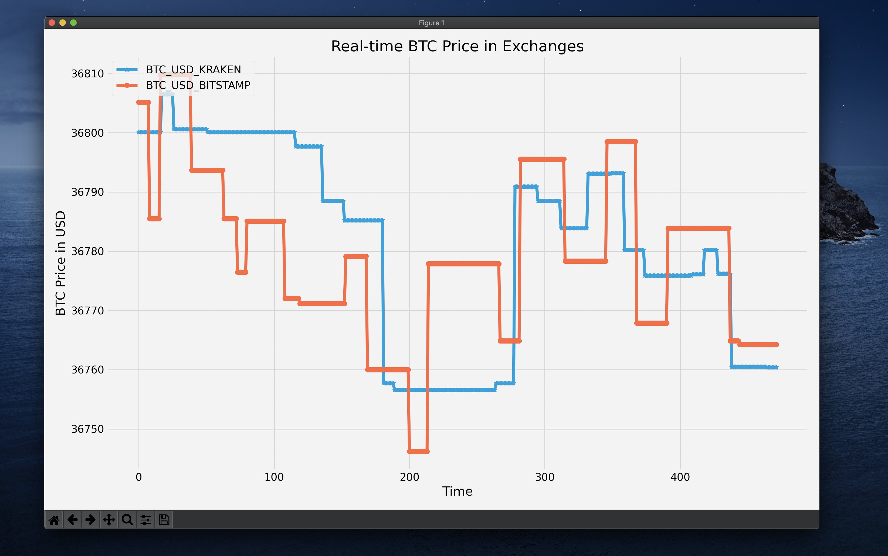

# CryptocurrencyPrices
Real time cryptocurrency prices

**Programmed in Python**

# How it works
```
Program sends requests on Kraken and Bitstamp public end-point API and recieve back real-time prices of Cryptocurrencies.

```
# How to use

### Python3+
```
git clone https://github.com/govivek/CryptocurrencyPrices.git

cd CryptocurrencyPrices && pip install -r requirements.txt

python data_gen.py

New terminal tab

python plot.py

```

